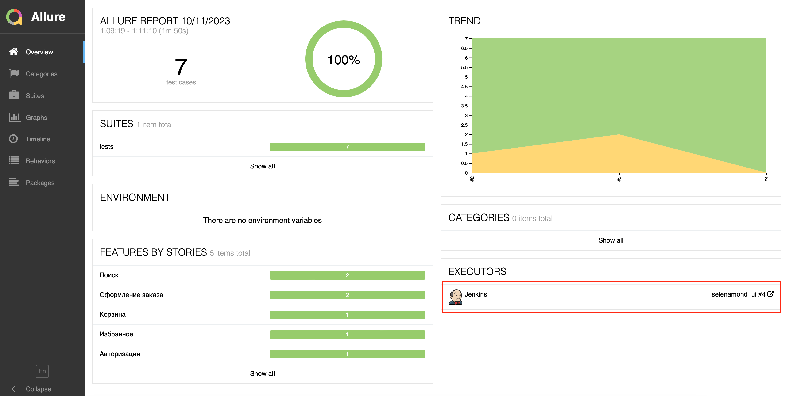

# Автотесты для сайта магазина Книги на Бауманской

### Ссылка на сайт:
* https://www.dom-knigi.ru/


## UI Тесты:

- [x] Поиск товаров по автору
- [x] Добавление товаров в корзину
- [x] Добавление товаров в избранное
- [x] Оформление заказа с отказом от обработки персональных данных
- [x] Поиск отсутствующего товара 
- [x] Ввод неверного промокода в корзине
- [x] Авторизация с данными незарегистрированного пользователя


<!-- Технологии -->

### Используемые технологии
<p  align="center">
  <code></code>
  <code></code>
  <code></code>
  <code></code>
  <code></code>
  <code></code>
  <code></code>
  <code></code>
</p>


## Запуск тестов
#### По умолчанию все тесты запускаются удалённо на Selenoid

### Для локального запуска
1. Склонируйте репозиторий
2. Откройте проект в PyCharm
3. Введите в териминале команду
``` 
python -m venv .venv
source .venv/bin/activate
pip install -r requirements.txt
pytest .
```
<!-- Jenkins -->

##  Запуск тестов из [Jenkins](https://jenkins.autotests.cloud/job/selenamond_ui_shop/):

#### При нажатии на "Собрать сейчас" начнется сборка тестов и их прохождение, через виртуальную машину Selenoid.


#### Из Jenkins можно сразу перейти к отчету в Allure Reports, нажав на соответвующую кнопку.

##  Отчет о пройденных тестах в [Allure Report](https://jenkins.autotests.cloud/job/selenamond_ui_shop/allure/):

<!-- Allure report -->

#### После прохождения тестов, результаты можно посмотреть в Allure отчете, где так же содержится ссылка на Jenkins.


#### Если тест запускался локально:
Введите в терминале команду для создания отчета в Allure Reports
```
allure serve allure-results
``` 
##### Во вкладке Graphs можно посмотреть графики о прохождении тестов, по их приоритезации, по времени прохождения и др.


##### Во вкладке Suites находятся собранные тест кейсы со статусом и временем выполнения, описанием тестовых шагов.
#### В teardown каждого теста можно посмотреть видеозапись прохождения теста, скриншот страницы, page_source и логи браузера.


<!-- Telegram -->

###  Интеграция с Telegram
##### После прохождения тестов, в Telegram bot приходит сообщение с графиком и информацией о выполненных тестах


